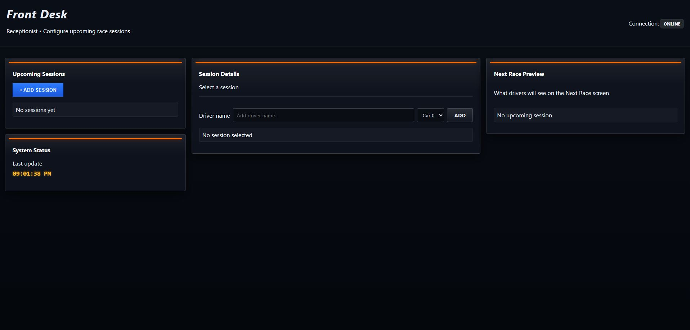
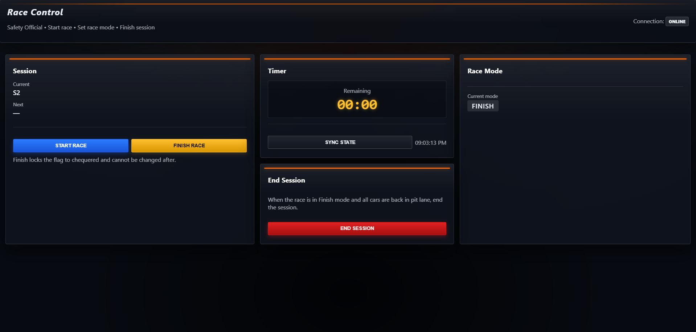
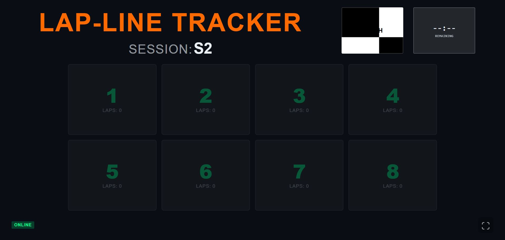

# Racetrack Info-Screens

This is a full-stack application for managing and displaying real-time racetrack information at Beachside Racetrack. The project features a Node.js/Express backend with Socket.io for real-time orchestration and a Vanilla JS frontend.

## Prerequisites

- **Node.js**: Version 18.x or higher is recommended.
- **npm**: Node Package Manager.

## Configuration & Security

To protect employee interfaces, the server requires access keys to be set as environment variables before starting. If these keys are not provided, the server will intentionally fail to start and display a usage error.

Create a `.env` file in the root directory or export the following variables in your terminal:

```bash
export RECEPTIONIST_KEY=<your key>
export SAFETY_KEY=<your key>
export OBSERVER_KEY=<your key>

# Optional overrides:
export PORT=8080
export SQLITE_FILE=db.sqlite
```

_(Note: If an incorrect key is provided by the client, the server enforces a 500ms delay before responding to prevent brute-force attacks)._

## Installation & Launch

1. Clone the repository and navigate to the root directory.
2. Install the required dependencies:

```bash
npm install
```

### Development Mode (1-minute races)

Starts the server with hot-reloading (using `nodemon`). In this mode, race timers are shortened to **1 minute** for testing purposes.

```bash
npm run dev
```

### Production Mode (10-minute races)

Launches the project in a production environment. Race timers are set to the standard **10 minutes**.

```bash
npm start
```

## Running Tests

This project uses `vitest` for testing. To execute the test suite, run:

```bash
npm test
```

---

## User Guide

Once the server is running, the application is accessible at `http://localhost:8080/` (or your configured port).

### Employee Interfaces (Require Access Keys)

#### 1. Front Desk (`/front-desk`)

- **Access Key:** `RECEPTIONIST_KEY`
- **Usage:** The receptionist uses this screen to manage upcoming race sessions. To set up a race: click "Add session" to create a new session, then add drivers to it by entering a name and optionally a car number. If no car number is entered, one will be assigned automatically. Drivers can be edited or removed after adding. Sessions can also be deleted.



#### 2. Race Control (`/race-control`)

- **Access Key:** `SAFETY_KEY`
- **Usage:** The safety official uses this screen to control the race. Start a race with the "Start race" button, then use the flag buttons to set the race mode: Safe (green), Hazard (yellow), or Danger (red). When the race is over, click "Finish race" to lock the mode to Finish — the flag buttons will disappear and "End session" button will appear. Click 'End session' to close the session and load the next one.



#### 3. Lap-line Tracker (`/lap-line-tracker`)

- **Access Key:** `OBSERVER_KEY`
- **Usage:** Used by the observer to record laps. Press the button matching the car number (1–8) each time that car crosses the lap line. Buttons are disabled when no race is active.



### Public Displays (No Key Required)

_(These screens feature a button to launch in full-screen mode)_

- **Leader Board (`/leader-board`):** Shows live race standings sorted by fastest lap. Shows driver name, car number, total laps, and best lap time.
- **Next Race (`/next-race`):** Shows the driver lineup for the upcoming session. Displays the session ID and all registered drivers with their car numbers.
- **Race Flags (`/race-flags`):** Full-screen display of the current race mode — green for Safe, yellow for Hazard, red for Danger, and chequered for Finish.
- **Race Countdown (`/race-countdown`):** Countdown timer showing how much time is left in the current race.

